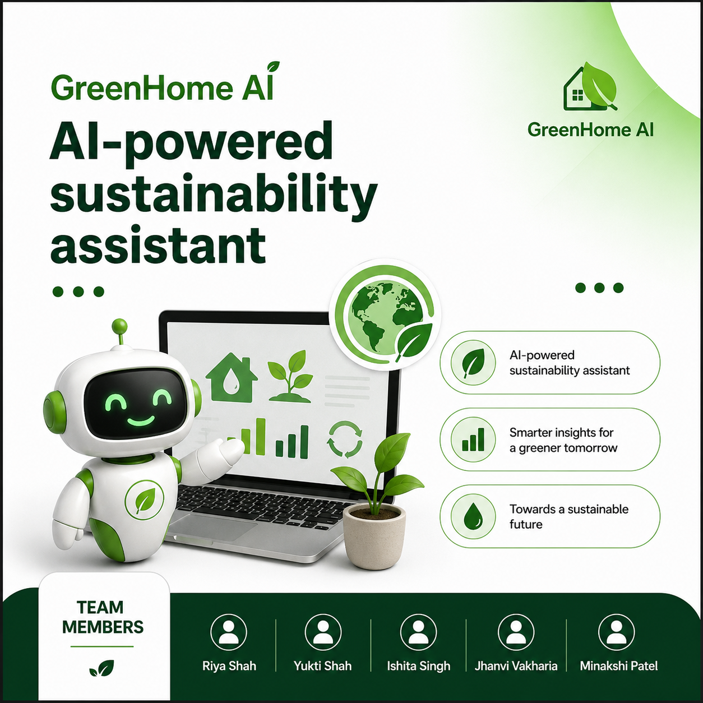
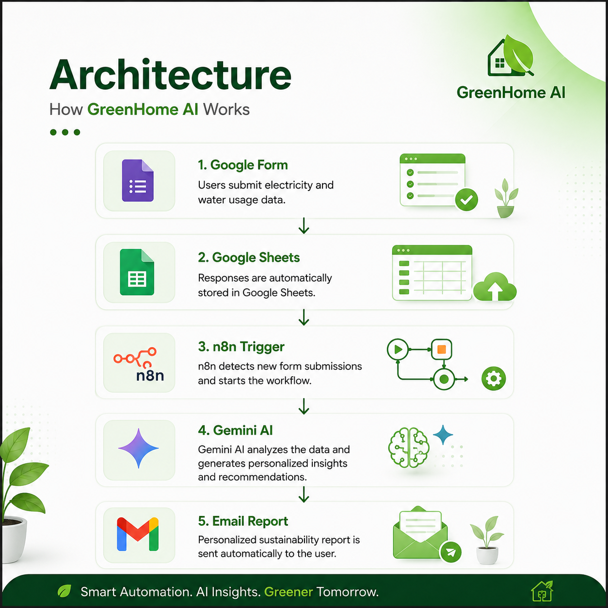

# 🌱 GreenHome AI

<p align="center">
  
</p>

<p align="center">


</p>

---

## 📖 Project Overview

**GreenHome AI** is an **AI-powered Sustainability Assistant** that automates the process of collecting household electricity and water consumption data, analyzing usage patterns using **Google Gemini AI**, and delivering personalized sustainability reports directly to users via email.

The entire workflow is orchestrated using **n8n**, enabling a fully automated, event-driven pipeline with no manual intervention.

---

## ✨ Features

- 📋 Collects utility usage through **Google Forms**
- 📊 Stores responses in **Google Sheets**
- ⚡ Automatically triggers workflows using **n8n**
- 🤖 Uses **Google Gemini AI** for intelligent sustainability analysis
- 💰 Estimates monthly utility costs
- 🌿 Generates personalized energy & water saving recommendations
- 📧 Automatically sends HTML reports using **Gmail**
- 🐳 Self-hosted locally using **Docker**

---

# 🏗 System Architecture

<p align="center">

</p>

### Workflow

```
Google Form
      │
      ▼
Google Sheets
      │
      ▼
Google Sheets Trigger (n8n)
      │
      ▼
Google Gemini AI
      │
      ▼
Generate Sustainability Report
      │
      ▼
Gmail
      │
      ▼
User receives personalized report
```

---

# 🛠 Tech Stack

| Category | Technologies |
|----------|--------------|
| Workflow Automation | n8n |
| AI | Google Gemini API |
| Data Collection | Google Forms |
| Database | Google Sheets |
| Email Service | Gmail API |
| Containerization | Docker |
| Authentication | Google OAuth2 |

---

# ⚙️ n8n Workflow

<p align="center">

</p>

The automation consists of **three core nodes**:

### 1️⃣ Google Sheets Trigger

- Monitors new Google Form responses
- Automatically starts the workflow whenever a new row is added

### 2️⃣ Google Gemini AI

- Receives electricity and water usage data
- Performs AI-powered sustainability analysis
- Estimates utility costs
- Generates personalized recommendations
- Creates a weekly action plan

### 3️⃣ Gmail

- Sends the AI-generated HTML report
- Delivers the report directly to the user's email

---

# 📧 Sample AI Report

<p align="center">

</p>

Each report contains:

- Waste Analysis
- Estimated Monthly Bill
- Energy Saving Tips
- Water Saving Tips
- Weekly Sustainability Action Plan

---

# 📂 Repository Structure

```
GreenHome-AI
│
├── README.md
├── LICENSE
├── workflow
│   └── GreenHome_AI_Automation.json
│
├── documentation
│   └── Project_Documentation.pdf
│
├── screenshots
│   ├── banner.png
│   ├── architecture.png
│   ├── workflow.png
│   └── sample-email.png
│
└── sample-output
    └── Sample_Sustainability_Report.pdf
```

---

# 🚀 Future Enhancements

- PostgreSQL Integration
- Historical Consumption Dashboard
- Carbon Footprint Calculator
- Smart Meter Integration
- Predictive Energy Consumption
- User Authentication
- Mobile Application
- Grafana Analytics Dashboard

---

# 👨‍💻 Team

- **Riya Shah**
- **Yukti Shah**
- **Ishita Singh**
- **Jhanvi Vakharia**
- **Minakshi Patel**

---

# 🎯 Skills Demonstrated

- Workflow Automation
- AI Integration
- Prompt Engineering
- API Integration
- Docker
- Google Cloud OAuth2
- Event-Driven Architecture
- No-Code / Low-Code Development
- Generative AI
- Automation Engineering

---

## ⭐ If you found this project interesting, consider giving it a Star!
